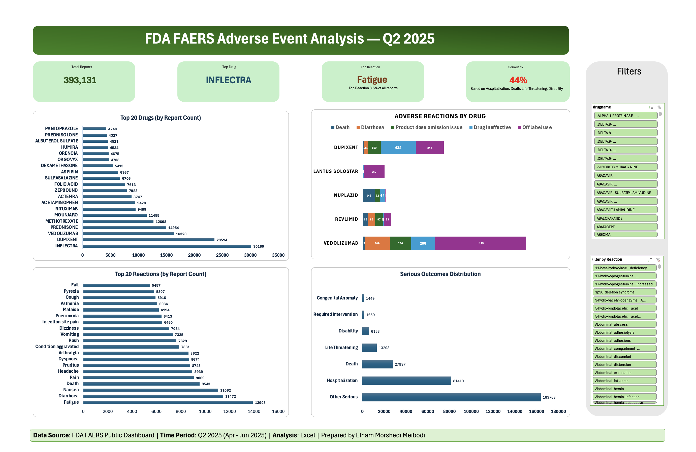

# FDA FAERS Adverse Event Analysis — Q2 2025 | Excel Dashboard

## Project Overview
Large-scale analysis of 393,131 adverse event reports submitted to the 
FDA Adverse Event Reporting System (FAERS) in Q2 2025 (April–June 2025).
This project identifies high-risk drugs, common adverse reactions, and 
serious outcome patterns using Microsoft Excel and Power Query.

- **Time Period:** April 1 – June 30, 2025
- **Data Source:** FDA FAERS Quarterly Data Extract (ASCII format)
- **Tools Used:** Microsoft Excel, Power Query, PivotTables, PivotCharts
- **Status:** Completed

## Key Findings
- 393,131 total adverse event reports analyzed
- INFLECTRA was the most reported drug with 30,160 reports
- Fatigue was the most common adverse reaction (3.5% of all reports)
- 44% of all reports involved serious outcomes
- Hospitalization was the leading serious outcome with 81,419 cases
- Death was reported in 27,937 cases

## Objectives
- Identify top drugs with the highest adverse event report counts
- Determine the most frequently reported adverse reactions
- Evaluate severity outcomes, including hospitalization and death
- Generate insights to support post-market safety monitoring

## Methodology
This project follows a structured six-phase analytics framework:

| Phase | Description |
|-------|-------------|
| Ask | Define objectives and analytical questions |
| Prepare | Understand data sources and structure |
| Process | Clean, validate, filter, and merge datasets |
| Analyze | Identify trends and patterns |
| Share | Build an interactive Excel dashboard |
| Act | Generate safety monitoring recommendations |

## Data Structure
Seven relational FAERS files merged using PRIMARYID as the common key:

| File | Description |
|------|-------------|
| DEMO | Patient demographics |
| DRUG | Drug and product details |
| REAC | Adverse reactions |
| OUTC | Patient outcomes |
| INDI | Indications for use |
| RPSR | Report source |
| THER | Therapy start and end dates |

## Key Analytical Steps
- Filtered FAERS datasets for primary suspect products
- Cleaned and standardized drug and reaction naming conventions
- Merged multiple relational tables using PRIMARYID via Power Query
- Built PivotTables and an interactive dashboard with dynamic slicers
- Analyzed serious outcome distribution across all outcome categories

## Dashboard Features
- 4 KPI cards: Total Reports, Top Drug, Top Reaction, Serious %
- Top 20 Adverse Reactions horizontal bar chart
- Top 20 Drugs by Report Count horizontal bar chart
- Serious Outcomes Distribution chart
- Adverse Reactions by Drug stacked bar chart
- 2 interactive slicers for dynamic filtering by drug and reaction

## Analytical Questions Addressed
- Which drugs had the highest adverse event reporting frequency?
- What reactions were reported most frequently?
- What percentage of cases resulted in hospitalization or death?
- Which drugs warrant increased post-market safety monitoring?

## Data Privacy and Compliance
- All FDA FAERS data is publicly available and de-identified
- No personal patient identifiers are included
- All analytical methods and transformations are fully documented

## Important Disclaimer
FAERS data represent reported associations and do not establish causation.
Submission of a report does not confirm that a drug caused the adverse 
event. This project is for educational and portfolio purposes only.
Healthcare decisions should always be guided by licensed professionals.

## Author
Elham Morshedi Meibodi, DMD, MS
MS Health Informatics — Boston University
Healthcare Data Analyst
GitHub: https://github.com/morshediem-mm

---
Last Updated: April 2026
